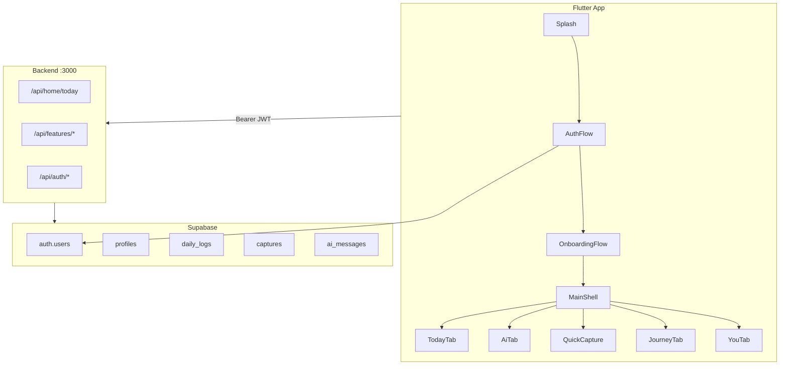
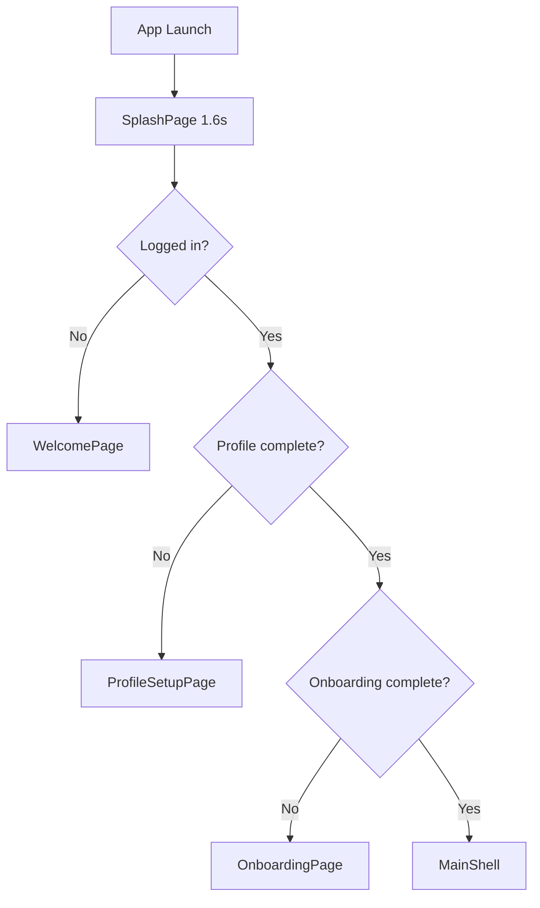
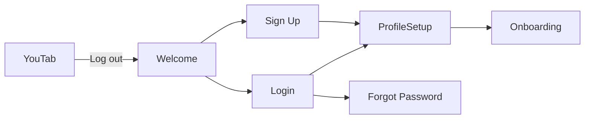
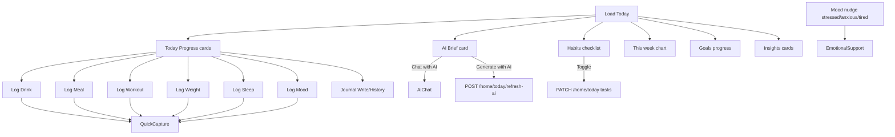
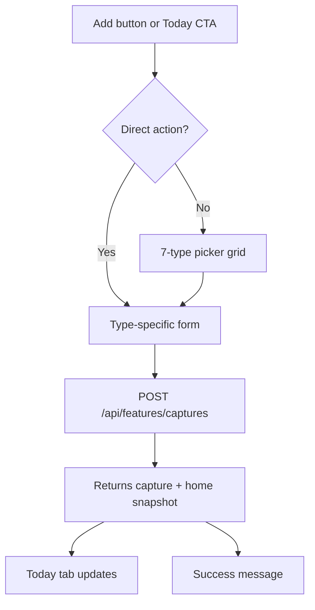
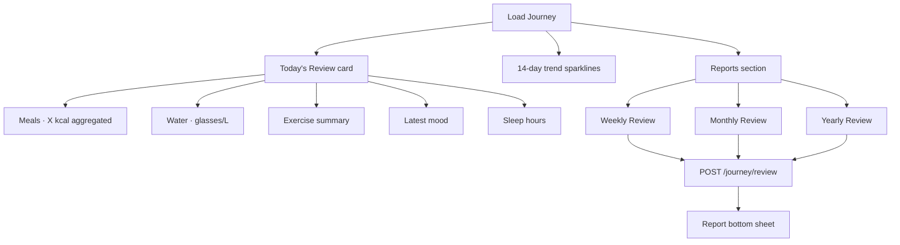
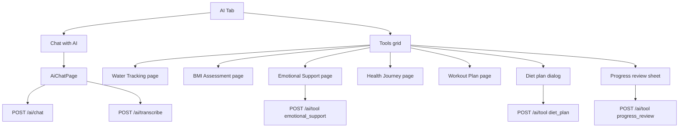
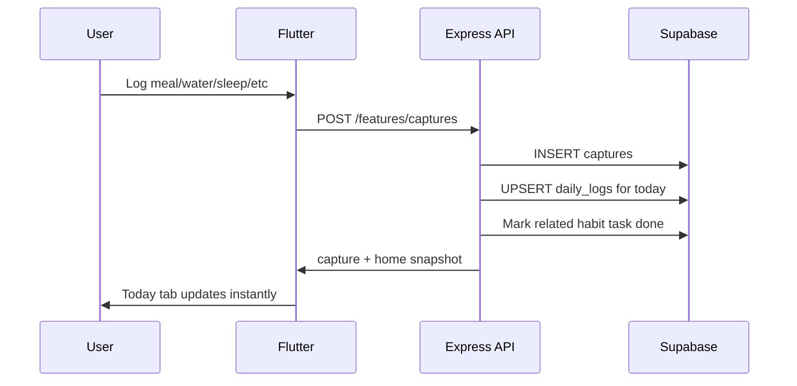

# Harmonious — Complete App Flows

Harmonious is a wellbeing tracker: **Flutter frontend** + **Express backend** (port 3000) + **Supabase** (auth + Postgres). Navigation uses named routes pre-home, then a 5-tab shell.

---

## High-Level Architecture

---

## 1. App Launch & Bootstrap

**Entry:** [`frontend/lib/main.dart`](../frontend/lib/main.dart) → [`frontend/lib/app/app.dart`](../frontend/lib/app/app.dart)

**Routes** ([`frontend/lib/core/constants/app_routes.dart`](../frontend/lib/core/constants/app_routes.dart)):

| Route | Screen |
|-------|--------|
| `/` | Splash |
| `/welcome` | Welcome |
| `/sign-up`, `/login`, `/forgot-password` | Auth |
| `/profile-setup` | Profile Setup |
| `/onboarding` | Onboarding |
| `/home` | Main Shell (5 tabs) |

### Splash decision tree

**Files:** [`splash_page.dart`](../frontend/lib/features/splash/presentation/splash_page.dart), [`auth_service.dart`](../frontend/lib/core/services/auth_service.dart), [`profile_service.dart`](../frontend/lib/core/services/profile_service.dart)

---

## 2. Authentication Flow

| Step | Action | Backend / Storage |
|------|--------|-------------------|
| Sign up | Email + password | Supabase Auth → `profiles` row |
| Login | Credentials | Supabase session JWT |
| Forgot password | Email | `POST /api/auth/forgot-password` → Mailtrap OTP |
| Reset password | Code + new password | `POST /api/auth/reset-password` |
| Profile setup | Name, age, height, weight | Supabase `profiles` upsert (skip allowed) |
| Delete account | You tab (if exposed) | `DELETE /api/auth/account` |

---

## 3. Onboarding Flow

**File:** [`frontend/lib/features/onboarding/presentation/onboarding_page.dart`](../frontend/lib/features/onboarding/presentation/onboarding_page.dart)

**Steps (in order):**

1. **Welcome** — intro
2. **Goals** — pick ≥1 goal (required)
3. **Goal details** — skipped if not needed
4. **Pulse** — activity, sleep, water habits
5. **Health** — conditions, medications
6. **Food** — diet preferences
7. **Summary** — review → Enter app

**On finish:**
- Rule-based `AiProfileBuilder` builds profile locally
- `OnboardingService.saveOnboarding()` → Supabase `profiles.onboarding_data`
- Navigate to `/home` (Main Shell)
- Optional: `POST /api/onboarding/ai-summary` (AI enhance — only if user/API triggers)

---

## 4. Main Shell — 5-Tab Navigation

**File:** [`frontend/lib/features/home/presentation/main_shell.dart`](../frontend/lib/features/home/presentation/main_shell.dart)

| Tab | Index | Screen | Role |
|-----|-------|--------|------|
| **Today** | 0 | [`today_tab.dart`](../frontend/lib/features/home/presentation/tabs/today_tab.dart) | Daily dashboard |
| **AI** | 1 | [`ai_tab.dart`](../frontend/lib/features/home/presentation/tabs/ai_tab.dart) | Coach + tools |
| **Add** | 2 | *(modal)* | Opens Quick Capture sheet |
| **Journey** | 3 | [`journey_tab.dart`](../frontend/lib/features/home/presentation/tabs/journey_tab.dart) | Review + trends + reports |
| **You** | 4 | [`you_tab.dart`](../frontend/lib/features/home/presentation/tabs/you_tab.dart) | Profile + settings |

**Cross-tab behavior:**
- After logging → switches to Today, applies fresh dashboard data
- Journey/AI refresh when tab gains focus (dirty flag)
- Today can jump to AI tab + open chat

---

## 5. Today Tab Flow

**Data:** `GET /api/home/today` via [`home_service.dart`](../frontend/lib/core/services/home_service.dart)

### Today sections (top → bottom)

1. **Header** — greeting, name, date
2. **AI Brief** — focus items, encouragement; optional AI refresh (on-demand only)
3. **Today Progress** — metric cards with log CTAs:
   - Water, Calories, Exercise, Weight, Sleep, Mood, Journal
   - Sleep: amber hint if not logged; nudge if under 8 h goal
   - Mood: coral/amber styling + nudge for stressed/anxious/tired
4. **Habits** — daily task toggles
5. **This week** — bar chart + water sparkline
6. **Goals** — active goal progress bars
7. **Insights** — rule-based (or AI if previously generated) category cards

**Pull-to-refresh:** reloads tracked data only (no auto AI).

---

## 6. Quick Capture (+) Flow

**File:** [`frontend/lib/features/home/presentation/widgets/quick_add_sheet.dart`](../frontend/lib/features/home/presentation/widgets/quick_add_sheet.dart)

**Triggers:**
- Bottom nav **Add** button
- Today tab metric CTAs (skips picker, opens form directly)

### Capture types

| UI label | Type | Payload | Updates daily_logs |
|----------|------|---------|-------------------|
| Log Meal | `meal` | calories, name | +calories, breakfast task |
| Log Drink | `water` | ml/liters/glasses | +water_liters, water task |
| Log Weight | `weight` | weight kg | weight + profile sync |
| Log Workout | `workout` | minutes, activity | +exercise_minutes, workout task |
| Log Mood | `mood` | Happy/Neutral/Stressed/Tired/Anxious | mood |
| Log Sleep | `sleep` | hours | sleep_hours, sleep task |
| Journal | `journal` | text | capture only, journal task |

### Meal logging sub-flow

1. Search field (USDA food search) **or** manual calories
2. `GET /api/features/foods/search?query=` → ranked generic foods (brands deprioritized)
3. Tap result → preview kcal → adjust → **Log [food]**
4. Empty/error states: no results, network, API not configured

### Water/drink sub-flow

- Preset amounts (glasses/ml)
- Coffee/Tea quick presets
- No photo required

### Journal sub-flow

- Write entry in sheet
- **History** → `GET captures?limit=100` filtered by journal type

**Photo capture removed** — all logging is text/manual.

---

## 7. Journey Tab Flow

**File:** [`frontend/lib/features/home/presentation/tabs/journey_tab.dart`](../frontend/lib/features/home/presentation/tabs/journey_tab.dart)  
**Data:** `GET /api/features/journey`

**Today's Review** replaces the old long per-event timeline — 5 aggregated rows, easy to scan.

**Reports:** AI-generated when OpenAI key exists; **rule-based fallback** from logs when not. Shows "From your logs" badge.

---

## 8. AI Tab Flow

**File:** [`frontend/lib/features/home/presentation/tabs/ai_tab.dart`](../frontend/lib/features/home/presentation/tabs/ai_tab.dart)

### AI tools

| Tool | Opens | AI? |
|------|-------|-----|
| Water intake | [`water_tracking_page.dart`](../frontend/lib/features/home/presentation/pages/water_tracking_page.dart) | Rule-based hydration tips |
| BMI check | [`bmi_assessment_page.dart`](../frontend/lib/features/home/presentation/pages/bmi_assessment_page.dart) | No AI — WHO math client-side |
| Emotional support | [`emotional_support_page.dart`](../frontend/lib/features/home/presentation/pages/emotional_support_page.dart) | AI on check-in; mantras/breathing local |
| Health journey | [`health_journey_page.dart`](../frontend/lib/features/home/presentation/pages/health_journey_page.dart) | Story from rules; optional AI analyze |
| Diet plan | In-tab dialog → result sheet | AI tool |
| Workout plan | [`workout_plan_page.dart`](../frontend/lib/features/home/presentation/pages/workout_plan_page.dart) | AI tool |
| Progress review | In-tab result sheet | AI with rule fallback |

### AI Chat flow

- Pick coach persona (Life, Nutrition, Fitness, Mental Wellness, Goal, Habit)
- Messages → `POST /api/features/ai/chat` (persisted unless `persist: false`)
- Voice input → Whisper transcription
- Session not auto-saved to Today dashboard

---

## 9. You Tab Flow

**File:** [`frontend/lib/features/home/presentation/tabs/you_tab.dart`](../frontend/lib/features/home/presentation/tabs/you_tab.dart)  
**Data:** `GET/PATCH /api/features/settings`

| Section | Action |
|---------|--------|
| Profile | Edit name, age, height, weight (dialog) |
| BMI Assessment | → BMI page |
| Goals | Chip picker bottom sheet |
| Health info | Conditions, meds, history |
| AI & App settings | Personality, theme, privacy, memory |
| Privacy & export | `GET settings/export` → clipboard |
| Log out | → Welcome |

**Photo picker removed** from profile.

---

## 10. Standalone Pages (pushed routes)

| Page | Reached from | Key behavior |
|------|--------------|--------------|
| AI Chat | Today brief, AI tab | Coach chat + voice |
| Water Tracking | AI tab | Quick-add ml, rule-based tips |
| BMI Assessment | AI tab, You tab | WHO categories, no AI |
| Emotional Support | AI tab, Today mood nudge | Mantras, breathing/grounding modals |
| Health Journey | AI tab | Full journey story + optional AI |
| Workout Plan | AI tab | Preferences → AI weekly plan |

---

## 11. Backend Data Flow (Capture → Dashboard)

### Core tables

| Table | Purpose |
|-------|---------|
| `profiles` | User profile, onboarding, goals, health_info, ai_memory |
| `daily_logs` | One row per user per UTC date — aggregated metrics + tasks + brief |
| `captures` | Individual log events (meals, water sips, journal, AI reports) |
| `ai_messages` | Chat history |

### AI cost policy (MVP)

- **Auto on load:** rule-based brief/insights only
- **AI on user action:** Chat, Generate with AI, diet/workout plans, progress review, emotional check-in
- **Never AI:** BMI, water math, journey trends, Today's Review aggregation, food search (USDA)

---

## 12. End-to-End User Journeys (Examples)

### New user
Splash → Welcome → Sign up → Profile setup → Onboarding (7 steps) → Today tab (empty dashboard) → Add first log

### Daily check-in
Open app → Today loads → Log water + meal via cards → Toggle habits → Glance Insights → Done

### Meal without knowing calories
Today → Log meal → Search "chicken" → Pick food → kcal pre-filled → Log → Calories card updates

### Stressed mood
Today → Mood shows "Stressed" + nudge → Tap nudge → Emotional Support → Breathing exercise

### Weekly review
Journey tab → Today's Review scan → Tap Weekly Review → Report sheet (rules or AI) → Highlights + next steps

### Settings change
You tab → Edit goals → PATCH settings → Today goals section updates on next load

---

## Key Source Files Reference

| Area | Path |
|------|------|
| Routes | [`frontend/lib/core/constants/app_routes.dart`](../frontend/lib/core/constants/app_routes.dart) |
| Main shell | [`frontend/lib/features/home/presentation/main_shell.dart`](../frontend/lib/features/home/presentation/main_shell.dart) |
| Quick capture | [`frontend/lib/features/home/presentation/widgets/quick_add_sheet.dart`](../frontend/lib/features/home/presentation/widgets/quick_add_sheet.dart) |
| Home API client | [`frontend/lib/core/services/home_service.dart`](../frontend/lib/core/services/home_service.dart) |
| Features API client | [`frontend/lib/core/services/feature_service.dart`](../frontend/lib/core/services/feature_service.dart) |
| Backend routes | [`backend/src/routes/features.js`](../backend/src/routes/features.js) |
| Captures | [`backend/src/controllers/captureController.js`](../backend/src/controllers/captureController.js) |
| Home/today | [`backend/src/controllers/homeController.js`](../backend/src/controllers/homeController.js) |
| Journey | [`backend/src/services/journeyStoryService.js`](../backend/src/services/journeyStoryService.js) |

---

## Backend API Quick Reference

| Method | Path | Purpose |
|--------|------|---------|
| `GET` | `/api/home/today` | Today dashboard payload |
| `PATCH` | `/api/home/today` | Update metrics / habit tasks |
| `POST` | `/api/home/today/refresh-ai` | Regenerate AI brief (on demand) |
| `POST` | `/api/features/captures` | Quick-capture log event |
| `GET` | `/api/features/captures` | List recent captures |
| `GET` | `/api/features/foods/search` | USDA food calorie lookup |
| `GET` | `/api/features/journey` | Journey story + today's review |
| `POST` | `/api/features/journey/review` | Weekly/monthly/yearly report |
| `GET/PATCH` | `/api/features/settings` | Profile, goals, app settings |
| `POST` | `/api/features/ai/chat` | AI coach chat |
| `POST` | `/api/features/ai/tool` | AI wellness tools |
| `POST` | `/api/features/ai/transcribe` | Voice-to-text |

All `/api/features/*` and `/api/home/*` routes require `Authorization: Bearer <supabase_jwt>`.
